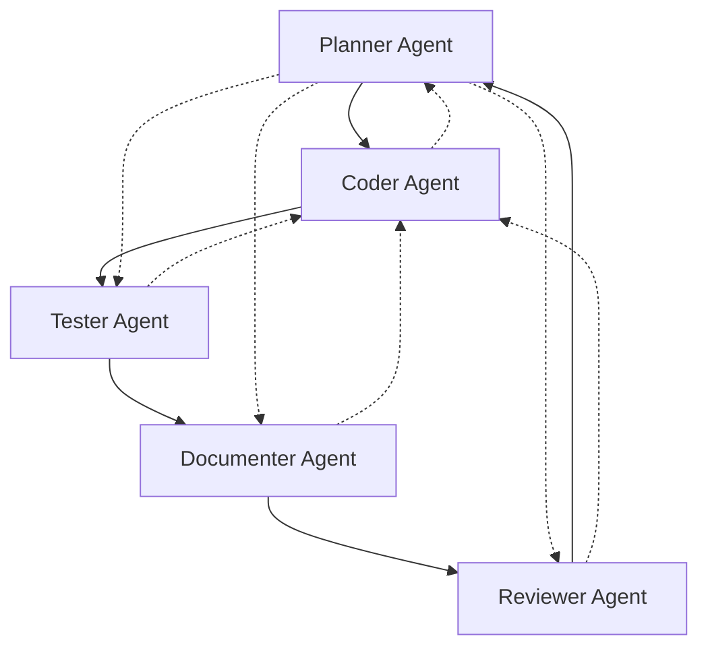

# 🤖 Agent Workflows Guide

*Comprehensive guide to understanding and using the multi-agent development system in Stack-Junkie-Framework.*

---

## 📖 Table of Contents

1. [Agent Overview](#agent-overview)
2. [Workflow Patterns](#workflow-patterns)
3. [Handoff Procedures](#handoff-procedures)
4. [Agent Specializations](#agent-specializations)
5. [Communication Protocols](#communication-protocols)
6. [Quality Gates](#quality-gates)
7. [Best Practices](#best-practices)

---

## 🎯 Agent Overview

The Stack-Junkie-Framework employs **five specialized AI agents** that work together in a coordinated workflow to ensure high-quality, secure software development.

### Agent Hierarchy and Flow



### Core Principles

1. **Single Responsibility**: Each agent has a specific focus area
2. **Quality Gates**: No progression without meeting standards
3. **Context Preservation**: All decisions and learnings are documented
4. **Security First**: Security considerations at every step
5. **Structured Handoffs**: Clear transitions between agents

---

## 🔄 Workflow Patterns

### Pattern 1: Feature Development Cycle

**Most Common Workflow**

```
Planner Agent → Coder Agent → Tester Agent → Documenter Agent → Reviewer Agent
```

#### 1. **Planning Phase** (Planner Agent)
- **Input**: Feature requirements, user stories
- **Activities**: 
  - Create detailed feature specifications
  - Define acceptance criteria
  - Make architectural decisions
  - Plan implementation approach
- **Output**: Updated PRD, implementation plan
- **Duration**: 15-30 minutes

#### 2. **Implementation Phase** (Coder Agent)
- **Input**: Feature specifications from Planner
- **Activities**:
  - Implement feature following security standards
  - Write unit and integration tests
  - Update configuration files
  - Create basic documentation
- **Output**: Working feature with tests
- **Duration**: 30-60 minutes

#### 3. **Testing Phase** (Tester Agent)
- **Input**: Implemented feature from Coder
- **Activities**:
  - Comprehensive testing strategy
  - Edge case validation
  - Performance testing
  - Security testing
- **Output**: Test reports, bug findings
- **Duration**: 20-40 minutes

#### 4. **Documentation Phase** (Documenter Agent)
- **Input**: Tested feature from Tester
- **Activities**:
  - Update user documentation
  - Create API documentation
  - Update README and guides
  - Validate examples work
- **Output**: Complete documentation
- **Duration**: 15-30 minutes

#### 5. **Review Phase** (Reviewer Agent)
- **Input**: Complete feature with docs
- **Activities**:
  - Code quality assessment
  - Security audit
  - Performance analysis
  - Improvement recommendations
- **Output**: Quality report, approval/recommendations
- **Duration**: 20-30 minutes

### Pattern 2: Emergency Bug Fix

**Fast Track Workflow**

```
Tester Agent → Coder Agent → Reviewer Agent
```

- **Skip Planning**: Use existing specifications
- **Focus on Fix**: Minimal scope, maximum safety
- **Quick Review**: Security and regression focus

### Pattern 3: Architecture Planning

**Strategic Workflow**

```
Planner Agent → Reviewer Agent → Planner Agent
```

- **Deep Planning**: Complex architectural decisions
- **Expert Review**: Validate approach before implementation
- **Refined Planning**: Adjust based on review feedback

### Pattern 4: Documentation Sprint

**Documentation Focus**

```
Documenter Agent → Reviewer Agent → Documenter Agent
```

- **Comprehensive Updates**: Major documentation overhaul
- **Quality Review**: Ensure accuracy and completeness
- **Polish**: Final improvements and validation

---

## 🤝 Handoff Procedures

### Universal Handoff Requirements

Every agent handoff must include:

1. **Current State Summary** - What's been accomplished
2. **Quality Status** - Tests passing, code clean, docs updated
3. **Next Steps** - Specific tasks for receiving agent
4. **Context & Decisions** - Important information to preserve
5. **Blockers & Issues** - Any problems encountered

### Handoff Template Usage

```markdown
## Handoff Summary
**From:** [Current Agent]
**To:** [Next Agent]
**Feature:** [Feature being worked on]

## Work Completed
- [Specific accomplishment 1]
- [Specific accomplishment 2]

## Current State
- **Tests:** [Passing/Failing status]
- **Code Quality:** [Clean/Issues]
- **Documentation:** [Updated/Needs work]

## Next Agent Tasks
1. [Specific task 1]
2. [Specific task 2]

## Important Context
- [Key decision 1 and rationale]
- [Key decision 2 and rationale]

## Success Criteria
- [How to know the work is complete]
```

### Agent-Specific Handoff Rules

#### **From Planner Agent**
- **To Coder**: Complete specifications, clear acceptance criteria
- **To Tester**: Testing strategy and requirements
- **To Documenter**: Documentation requirements and scope
- **To Reviewer**: Review criteria and focus areas

#### **From Coder Agent**
- **To Tester**: Working feature, test instructions, known limitations
- **To Planner**: Scope changes or architectural questions
- **Emergency Handoff**: At 75% token capacity with safe commit point

#### **From Tester Agent**
- **To Coder**: Bug reports with reproduction steps
- **To Reviewer**: Test results and quality metrics
- **To Documenter**: Testing procedures to document

#### **From Documenter Agent**
- **To Any Agent**: Updated documentation, validation needs
- **Documentation Complete**: All docs current and accurate

#### **From Reviewer Agent**
- **To Planner**: Strategic recommendations, architectural changes
- **To Coder**: Specific improvements, refactoring needs
- **Approval**: Quality gates met, ready for next phase

---

## 🎯 Agent Specializations

### Planner Agent: The Architect

**Core Responsibilities:**
- Product Requirements Document (PRD) creation and maintenance
- Feature breakdown and prioritization
- Architectural decision making
- Cross-feature coordination

**Decision-Making Authority:**
- Technology stack choices
- Architecture patterns
- Feature scope and priority
- Agent task assignments

**Key Artifacts:**
- `prd.md` - Complete product specifications
- `todo.md` - Prioritized feature list
- `memory-bank.md` - Architectural decisions
- Feature specification updates

**Session Characteristics:**
- **Duration**: Long-running (2-4 hours)
- **Context**: Rich, comprehensive
- **Focus**: Strategic planning and coordination

### Coder Agent: The Builder

**Core Responsibilities:**
- Feature implementation with security focus
- Test creation and basic validation
- Technical file management
- Environment configuration

**Implementation Standards:**
- Security-first development (OWASP Top 10)
- Test-driven development
- Code quality standards (max 300 lines/file)
- Documentation integration

**Key Artifacts:**
- Source code implementations
- Unit and integration tests
- Configuration files (package.json, requirements.txt)
- Environment setup (.env templates)

**Session Characteristics:**
- **Duration**: Task-focused (1-2 hours)
- **Context**: Implementation-specific
- **Focus**: Single feature completion

### Tester Agent: The Validator

**Core Responsibilities:**
- Comprehensive test strategy development
- Bug discovery and documentation
- Performance validation
- Security testing

**Testing Approach:**
- **Unit Testing**: Individual component validation
- **Integration Testing**: Feature workflow validation
- **End-to-End Testing**: User journey validation
- **Performance Testing**: Load and stress testing
- **Security Testing**: Vulnerability scanning

**Key Artifacts:**
- Test suites and strategies
- Bug reports with reproduction steps
- Performance benchmarks
- Security validation reports

**Session Characteristics:**
- **Duration**: Verification-focused (1-2 hours)
- **Context**: Quality assurance focused
- **Focus**: Comprehensive validation

### Documenter Agent: The Communicator

**Core Responsibilities:**
- User-facing documentation
- API documentation
- Repository maintenance
- Code documentation review

**Documentation Types:**
- **User Guides**: How to use the application
- **API Documentation**: Technical reference
- **Setup Guides**: Installation and configuration
- **Troubleshooting**: Common issues and solutions

**Key Artifacts:**
- `README.md` updates
- User guides and tutorials
- API reference documentation
- GitHub repository files

**Session Characteristics:**
- **Duration**: Documentation-focused (1-2 hours)
- **Context**: User experience focused
- **Focus**: Clear communication

### Reviewer Agent: The Quality Guardian

**Core Responsibilities:**
- Code quality assessment
- Security audit
- Performance analysis
- Improvement recommendations

**Review Framework:**
- **Code Quality**: Maintainability, readability, standards
- **Security**: Vulnerability assessment, best practices
- **Performance**: Optimization opportunities
- **Architecture**: Design pattern validation

**Key Artifacts:**
- Quality assessment reports
- Security audit results
- Performance analysis
- Improvement roadmaps

**Session Characteristics:**
- **Duration**: Review-focused (1-2 hours)
- **Context**: Quality assessment focused
- **Focus**: Comprehensive evaluation

---

## 📞 Communication Protocols

### Agent-to-Agent Communication

#### **Structured Handoffs**
- Use standardized handoff templates
- Include complete context and rationale
- Specify clear next steps
- Document all decisions made

#### **Emergency Protocols**
- **Critical Issues**: Immediate escalation to appropriate agent
- **Security Vulnerabilities**: Direct to Reviewer Agent
- **System Down**: Focus on stabilization over process

#### **Context Management**
- **Token Awareness**: Monitor context usage continuously
- **Memory Updates**: Update persistent files regularly
- **Archive Strategy**: Move completed work to historical files

### User Communication

#### **Progress Updates**
- Clear status on current work
- Transparent about blockers and challenges
- Regular milestone reporting
- Success metrics tracking

#### **Asking for Clarification**
- When requirements are ambiguous
- When scope exceeds agent capability
- When external decisions are needed
- When user preferences are required

---

## ✅ Quality Gates

### Universal Quality Standards

**Every feature must meet:**
- [ ] Security requirements (OWASP Top 10 compliance)
- [ ] Test coverage >80%
- [ ] Code quality standards met
- [ ] Documentation updated
- [ ] Performance requirements met

### Agent-Specific Quality Gates

#### **Planner Agent Gates**
- [ ] PRD is complete and clear
- [ ] Acceptance criteria are testable
- [ ] Architecture decisions are documented
- [ ] Feature dependencies are identified

#### **Coder Agent Gates**
- [ ] Feature works as specified
- [ ] All tests pass
- [ ] Code follows style guidelines
- [ ] Security standards implemented

#### **Tester Agent Gates**
- [ ] Comprehensive test coverage achieved
- [ ] All bugs documented with reproduction steps
- [ ] Performance benchmarks established
- [ ] Security validation completed

#### **Documenter Agent Gates**
- [ ] User documentation is accurate
- [ ] API documentation matches implementation
- [ ] Examples are tested and working
- [ ] Installation instructions are validated

#### **Reviewer Agent Gates**
- [ ] Code quality meets standards
- [ ] Security audit completed
- [ ] Performance analysis done
- [ ] Improvement recommendations provided

---

## 💡 Best Practices

### For Development Teams

#### **Agent Selection**
```
Planning new features → Planner Agent
Implementing features → Coder Agent
Validating quality → Tester Agent
Updating documentation → Documenter Agent
Final review → Reviewer Agent
```

#### **Handoff Timing**
- **Normal**: At natural completion points
- **Token Limit**: At 75% context capacity
- **Complexity**: When expertise is needed
- **User Request**: When specifically requested

#### **Context Preservation**
- Always use handoff templates
- Update memory files regularly
- Document all important decisions
- Reference PRD frequently

### For Individual Agents

#### **Stay in Role**
- Focus on your specialization
- Don't overlap with other agents
- Request handoff when appropriate
- Follow your agent's guidelines

#### **Quality Focus**
- Never compromise on security
- Maintain high code quality
- Ensure comprehensive testing
- Keep documentation current

#### **Communication**
- Be clear and specific
- Document your reasoning
- Ask for clarification when needed
- Provide comprehensive handoffs

### Common Pitfalls to Avoid

❌ **Skipping handoff procedures**  
✅ Use structured handoffs every time

❌ **Overlapping agent responsibilities**  
✅ Stay within your agent's scope

❌ **Incomplete context transfer**  
✅ Provide comprehensive handoff information

❌ **Ignoring quality gates**  
✅ Meet all standards before progressing

❌ **Poor documentation of decisions**  
✅ Document rationale for all choices

---

## 🎯 Success Metrics

### Agent Performance Indicators

**Planner Agent:**
- Feature completion rate vs. plan
- Architecture decision quality
- Team coordination effectiveness

**Coder Agent:**
- Feature implementation velocity
- Code quality scores
- Bug introduction rate

**Tester Agent:**
- Bug discovery rate
- Test coverage achieved
- False positive rate

**Documenter Agent:**
- Documentation currency
- User satisfaction with docs
- Documentation completeness

**Reviewer Agent:**
- Quality improvement impact
- Security issue discovery
- Review thoroughness

### Overall Framework Success

- **Development Velocity**: Features delivered per sprint
- **Quality Metrics**: Bug rates, test coverage, performance
- **Security Posture**: Vulnerabilities found and fixed
- **Team Satisfaction**: Developer experience scores
- **User Adoption**: Framework usage and feedback

---

## 🚀 Advanced Workflows

### Multi-Feature Coordination

When working on multiple features simultaneously:

1. **Planner Agent** coordinates overall roadmap
2. **Feature-specific agents** work in parallel
3. **Integration points** are carefully managed
4. **Reviewer Agent** ensures overall coherence

### Continuous Integration Workflow

```
Code Commit → Automated Testing → Security Scan → Performance Check → Deployment
```

Each step has agent oversight:
- **Coder Agent**: Ensures quality commits
- **Tester Agent**: Validates automated tests
- **Reviewer Agent**: Reviews security and performance

### Crisis Management Workflow

For critical issues:
1. **Immediate Assessment** (any agent)
2. **Emergency Handoff** to appropriate specialist
3. **Focus on Stabilization** over process
4. **Post-Crisis Review** and improvement

---

*The multi-agent workflow ensures consistent quality, security, and velocity across all development activities. Master these patterns to maximize your development effectiveness! 🚀*